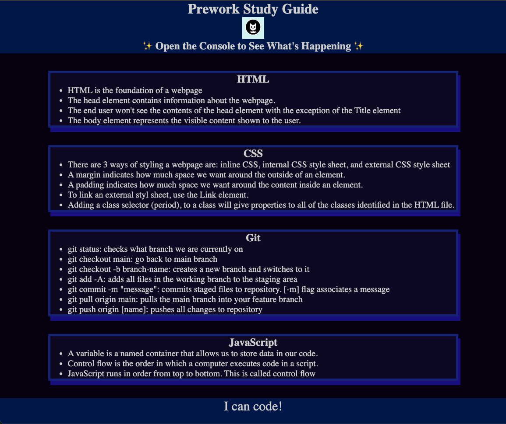
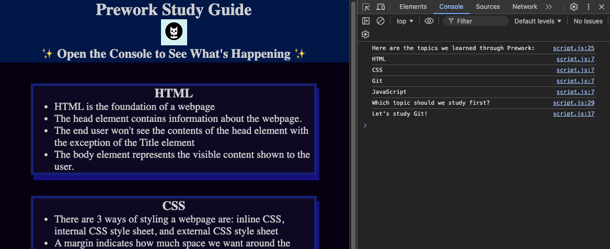

# Prework Study Guide Website

## Description

This Prework Study Guide was created with the lessons of the Bootcamp prework module. It is intended to help students study the basics of website coding. The guide helps students recall notes on the topics covered in the prework lessons. These are HTML, CSS, Git, and Java. In building this guide, I learned the fundamentals of web coding and Git flow.

## Installation

N/A

## Usage

To use this study guide, you can review the notes in each section.

For suggestions on what to study first, open the Chrome DevTools by pressing Command+Option+I (macOS) or Control+Shift+I (Windows). A console panel should open either below or to the side of the webpage in the browser. There you will see a list of topics we learned from the prework along with a suggestion on which topic to study first.

## Credits

N/A

## License

Please refer to the LICENSE in the repo.